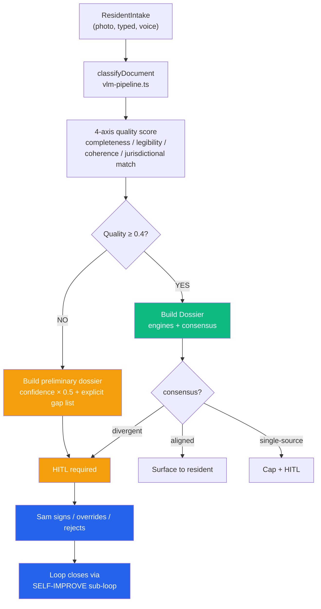
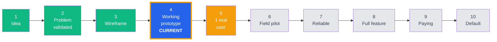

# FreeLeased Architecture — Diagrams

This file collects the canonical diagrams referenced by [`gauntlet-loop.md`](project/strategy/gauntlet-loop.md:1), [`loop-protocol.md`](project/strategy/loop-protocol.md:1), and [`maturity-ladder.md`](project/strategy/maturity-ladder.md:1).

---

## 1. Gauntlet Loop (5 sub-loops, single self-improving cycle)

```mermaid
flowchart TB
    subgraph Daily["DAILY AGENT (event-driven, per intake)"]
        P["Sub-loop 1<br/>PROCESS<br/>Intake + 4-axis<br/>quality scoring"]
        R["Sub-loop 2<br/>RESEARCH<br/>Spine lookup +<br/>citation chain"]
        U["Sub-loop 3<br/>UPDATE<br/>4-agent DS gauge +<br/>consensus gate"]
    end

    subgraph Overnight["OVERNIGHT AGENT (02:00 + 03:00 UTC)"]
        M["Sub-loop 4<br/>MAINTENANCE<br/>SLA staleness +<br/>conviction upgrade/downgrade"]
        S["Sub-loop 5<br/>SELF-IMPROVE<br/>Bayesian update<br/>from Sam's HITL"]
    end

    HITL["HITL<br/>(Sam)<br/>sign / override / reject"]

    P -->|ResidentIntake| R
    R -->|StatuteMatch[]| U
    U -->|Dossier| HITL
    HITL -->|HITLDecision| S
    M -->|MaintenanceReport| S
    S -->|ConvictionDelta| P

    style Daily fill:#2563eb,color:#fff
    style Overnight fill:#10b981,color:#fff
    style HITL fill:#f59e0b,color:#fff
```

## 2. Loop Topology — Codebase ↔ Strategy ↔ Doc

```mermaid
flowchart LR
    subgraph Strategy["STRATEGY (intent)"]
        S1[loop-protocol.md]
        S2[maturity-ladder.md]
        S3[trl-levels-freeleased.md]
        S4[truth-protocol.md]
        S5[multi-jurisdiction-legal-spine.md]
        S6[gauntlet-loop.md]
    end

    subgraph Code["CODEBASE (reality)"]
        C1[src/data/spine.ts<br/>9 jurisdictions, 30+ statutes]
        C2[src/lib/engines.ts<br/>4-agent DS gauge]
        C3[src/lib/consensus.ts<br/>aligned/divergent/single-source]
        C4[src/lib/learning.ts<br/>Bayesian conviction update]
        C5[src/lib/research.ts<br/>SLA + staleness]
        C6[scripts/test-suite.ts<br/>159/159 assertions]
    end

    subgraph Docs["DOCS (validation)"]
        D1[memory/data-room-map.md<br/>folder → TRL]
        D2[memory/data-room-copies.md<br/>reverse-copy journal]
        D3[Data Room/<br/>45 files, 22/24 folders] _(updated 2026-08-11 — TruthDiff caught this drift)_
        D4[AI_JOURNAL.md<br/>append-only loop log]
        D5[HEARTBEAT.md<br/>cadence + daily log]
    end

    S1 -.-> C2
    S1 -.-> C3
    S2 -.-> S3
    S3 -.-> D1
    S4 -.-> C3
    S5 -.-> C1
    S6 -.-> C4
    S6 -.-> C5
    C1 -.-> D3
    C2 -.-> C6
    C6 -.-> D4
    D1 -.-> D3
    D2 -.-> D3
    D3 -.-> D5

    style Strategy fill:#2563eb,color:#fff
    style Code fill:#10b981,color:#fff
    style Docs fill:#f59e0b,color:#fff
```

## 3. The Crumpled-Bill Principle (jurisdiction adaptation)



## 4. TRL Self-Assessment (current standing 2026-08-10)



## 5. Data Room Coverage Heat Map

```mermaid
flowchart TB
    subgraph TR1["TRL 1 — Company Overview"]:::done
        T1A[project_summary: 6]
        T1B[team: 2]
        T1C[pitch_deck: 3]
    end
    subgraph TR2["TRL 2 — Problem Validation"]:::done
        T2A[independent_research: 2]
        T2B[interview_notes: 3]
        T2C[survey_results: 3]
    end
    subgraph TR3["TRL 3 — Product Evidence"]:::done
        T3A[wireframes: 1]
        T3B[mockups: 2]
        T3C[demo_video: 2]
        T3D[screenshots: 0]:::empty
    end
    subgraph TR4["TRL 4 — Technical Proof"]:::done
        T4A[architecture: 1]
        T4B[code_samples: 4]
        T4C[test_results: 1]
        T4D[prototype_builds: 1]
    end
    subgraph TR5["TRL 5-10"]:::partial
        T5A[test_notes: 1]
        T5B[metrics: 1]
        T5C[pilot_feedback: 0]:::empty
        T5D[partnerships: 2]
        T5E[revenue: 0]:::empty
        T5F[releases: 0]:::empty
    end

    classDef done fill:#10b981,color:#fff
    classDef partial fill:#f59e0b,color:#fff
    classDef empty fill:#fee2e2,color:#991b1b
```

---

## How to read these diagrams

- **Diagram 1** = the gauntlet runtime. Trace one resident's journey through the 5 sub-loops.
- **Diagram 2** = the meta-loop: how strategy docs, code, and Data Room validate each other.
- **Diagram 3** = jurisdiction adaptation. Same 5 sub-loops, no special jurisdictions.
- **Diagram 4** = current TRL standing with the next level highlighted.
- **Diagram 5** = Data Room coverage at a glance. Green = populated, amber = partial, red = empty (honest gap).

These diagrams render natively on GitHub. For non-GitHub viewing, paste into [mermaid.live](https://mermaid.live).