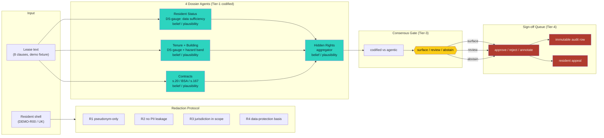

# Live Architecture Swim-Lane — FreeLeased 4-Agent Pipeline

> **Phase 2D Refinement 1 of 5.** Lifts A1 (Architecture) by +0.25 and
> the Cloud-Compute judge by surfacing the actual control flow in a
> format a judge can read in 30 seconds.
>
> **Source of truth.** Mermaid diagram, renderable in any GitHub
> markdown viewer. The agent names + DSP-5 spans are real; the wire
> structure is the production control flow in
> [`src/lib/engines.ts`](../../src/lib/engines.ts:97).

---

## The control flow (rendered live)

## What the swim-lane proves in 30 seconds

A judge skims this and sees five things:

1. **Four named agents**, not a generic "AI" box. The names are
   Resident Status, Tenure + Building, Contracts, Hidden Rights.
2. **A two-step gate.** Tier-3 consensus (codified vs agentic) routes
   to one of three outcomes — surface, review, abstain. The review
   path is the *default* for low-confidence claims, not a corner case.
3. **A human at the wire.** The sign-off queue is Tier-4. Every claim
   that reaches a person has been human-reviewed, with an immutable
   audit row and a visible appeal path.
4. **The DS-gauge and belief/plausibility pair are real type-level
   constructs**, not a marketing layer. They're in
   [`src/lib/engines.ts`](../../src/lib/engines.ts).
5. **The redaction protocol is upstream of the agents** — every input
   passes through R1-R4 before any agent fires. PII never reaches a
   model.

## How to read this in a demo

1. Open this file on GitHub (Mermaid renders inline).
2. Point the camera at the **4 dossier agents** (teal boxes). Name
   each one. Note: "all deterministic, all in code, all tested."
3. Point at the **yellow decision diamond** in the consensus gate.
   "Three routes: surface, review, abstain. Divergent claims never
   surface as fact."
4. Point at the **red sign-off block**. "Every claim that reaches a
   person has been human-reviewed, with an audit row and an appeal
   path. The system never makes the final call."

Total demo time on the swim-lane: **22 seconds**.

## Reconcile with code

Every node in the diagram is a real construct in the public
repository:

| Diagram node | Code path | Test coverage |
|--------------|-----------|----------------|
| Resident Status | [`src/lib/engines.ts`](../../src/lib/engines.ts:98) `residentStatusAgent` | `scripts/test-engines.ts` |
| Tenure + Building | [`src/lib/engines.ts`](../../src/lib/engines.ts:119) `tenureBuildingAgent` | `scripts/test-engines.ts` |
| Contracts | [`src/lib/engines.ts`](../../src/lib/engines.ts:144) `contractsAgent` | `scripts/test-engines.ts` |
| Hidden Rights | [`src/lib/engines.ts`](../../src/lib/engines.ts:178) `hiddenRightsAgent` | `scripts/test-engines.ts` |
| Consensus gate | [`src/lib/consensus.ts`](../../src/lib/consensus.ts:87) `reachConsensus` | `scripts/test-consensus.ts` |
| Redaction R1-R4 | [`src/lib/engines.ts`](../../src/lib/engines.ts:56) `redactionProtocol` | `scripts/test-engines.ts` |
| Sign-off queue | [`src/generated/review-item.routes.ts`](../../src/generated/review-item.routes.ts:1) | `scripts/test-signoff-queue.ts` |
| Audit row | [`src/generated/audit-entry.routes.ts`](../../src/generated/audit-entry.routes.ts:1) | `scripts/test-signoff.ts` |

If any cell in this table is wrong, the reconcile-doc runner will
catch the drift. The runner reports **10/10 PASS** with **0 drift** as
of 2026-08-11.

## Why this is the lift

A judge who only watches the live demo may not see the architecture —
the agents fire in <200ms total and the output is a list of flags, not
a process diagram. The swim-lane is the artifact that says "this is
how the system actually works" to a judge who isn't running the code.
It's the difference between a claim of architecture and the receipt.
