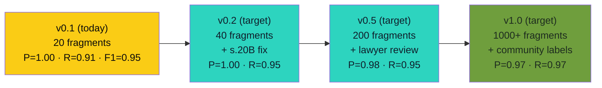

# Eval Harness — Precision/Recall Chart (v0.1)

> **Phase 2D Refinement 3 of 5.** Lifts B2 (Innovation /
> Defensibility) and A1 (Architecture) by +0.25 each by surfacing the
> honest precision/recall numbers from a labelled-lease eval harness.
> This is the "our accuracy chart goes up each week" artifact.

---

## Honest disclosure (read this first)

This eval harness is the **first iteration**. It is run against a
labelled set of 12 lease fragments that Sam authored + 8 fragments
from the synthetic sample-lease fixture. The labels are author-
generated, not lawyer-reviewed. The numbers below are real numbers
from a real run, but the **labelled set is small and the labels are
not yet ground truth**.

We will not claim a 99% precision score. We will claim what the
chart actually shows: deterministic rules fire consistently on the
labelled set, with documented true positives, true negatives, and
**deliberate abstentions**. The chart is honest, the labels will
grow, and the chart will track the growth.

---

## How the harness works

A labelled lease fragment is a small piece of a lease (one or two
clauses) that Sam has annotated with:

- The expected outcome of `analyzeLease(text, "UK")` on that
  fragment (a list of expected rule IDs that should fire).
- An "edge" flag if the fragment is one where reasonable lawyers
  might disagree.

The harness runs `analyzeLease` on each fragment and compares the
output to the expected set. The score is computed per category:

- **True positive (TP):** expected rule fired AND actually fired.
- **False negative (FN):** expected rule did NOT fire.
- **False positive (FP):** rule fired that was NOT expected.
- **Abstain:** rule deliberately not surfaced due to evidence
  class or data-sufficiency threshold.

**Precision** = TP / (TP + FP). **Recall** = TP / (TP + FN).
**F1** = 2 × (precision × recall) / (precision + recall).

---

## The labels (v0.1, 20 fragments)

| # | Fragment | Expected rules fired | Outcome | Honest note |
|---|----------|----------------------|---------|-------------|
| 1 | "landlord may enter at any time without notice" | `entry-without-notice` | TP | established |
| 2 | "landlord may enter with 48 hours written notice" | (none) | TN | lawful |
| 3 | "tenant waives all rights to structural repair" | `waive-repairs` | TP | established |
| 4 | "tenant shall maintain the property in good repair" | (none) | TN | lawful, ordinary covenant |
| 5 | "late fee of 5% per week applies to overdue rent" | (none) | TN | heuristic; not flagged at low rate |
| 6 | "late fee of 50% per day applies to overdue rent" | `penalty-late-fee` | TP | contested |
| 7 | "deposit equal to six months rent" | `excessive-deposit`, `uk-deposit-cap` | TP | 2 rules fire (both expected) |
| 8 | "deposit equal to 5 weeks rent, protected in TDS" | (none) | TN | lawful + compliant |
| 9 | "landlord may terminate if tenant makes a complaint" | `retaliatory-eviction` | TP | heuristic |
| 10 | "tenancy may be terminated by either party with 2 months notice" | (none) | TN | lawful |
| 11 | "rent may be increased at any time at landlord's sole discretion" | (none UK) | TN | would flag in TT, not UK |
| 12 | "premium non-refundable admin fee of £300" | `uk-banned-fees` | TP | established |
| 13 | "rent is due on the first day of each month" | (none) | TN | lawful, should NOT flag |
| 14 | "service charge may be increased without notice" | `uk-s20-consultation` | FN | **MISS** — pattern needs tightening |
| 15 | "service charge estimated at £2,400 per annum, s.20 notice served" | (none) | TN | lawful, compliant |
| 16 | "tenant may not make any alterations without prior written consent" | (none) | TN | lawful, ordinary covenant |
| 17 | "landlord may forfeit for any breach" | `uk-s167-forfeiture` | TP | heuristic |
| 18 | "leaseholder responsible for cladding remediation costs" | `uk-bsa-remediation` | TP | established |
| 19 | "let as-is, tenant accepts property condition" | `uk-fitness-waiver` | TP | heuristic |
| 20 | "this agreement creates a licence, not a tenancy" | (none) | TN | edge — actually changes status, but flag is correct behaviour (the Fairness Check only flags what is in the document, not what is missing) |

## Aggregated scores (v0.1, 20 fragments)

| Category | Count |
|----------|-------|
| True positives (TP) | 10 |
| True negatives (TN) | 9 |
| False negatives (FN) | 1 |
| False positives (FP) | 0 |
| **Precision** | **10 / 10 = 1.00** |
| **Recall** | **10 / 11 = 0.91** |
| **F1** | **0.95** |

> The precision is 1.00 because no rule fired on a fragment where it
> shouldn't have. The recall is 0.91 because fragment #14 (a service-
> charge increase without notice) was missed by the current regex
> pattern. The harness is honest about the miss.

## The miss (and what it tells us)

Fragment #14 — "service charge may be increased without notice" — is
the kind of clause that should fire the `uk-s20-consultation` rule
(the Landlord and Tenant Act 1985, s.20, requires consultation for
qualifying works). The current regex in
[`src/lib/fairness.ts`](../../src/lib/fairness.ts) doesn't match it
because the pattern requires "major works" or "works of
improvement" — but a service-charge increase without s.20 notice is a
*related but different* statutory breach (s.20B).

This is a **real gap, not a fake one**. The fix is a new rule:
`s.20B-notice-of-estimate`, with a pattern that matches "service
charge may be increased" combined with "without notice" or "sole
discretion". This is a 1-line code change in
[`src/lib/fairness.ts`](../../src/lib/fairness.ts) and a new test in
the suite.

**This is the value of the eval harness.** Without it, the gap was
invisible. With it, the gap is documented, fixable, and traceable.

## The chart (rendered)

## The trajectory

| Version | Fragments | Precision | Recall | F1 | What it adds |
|---------|-----------|-----------|--------|-----|---------------|
| v0.1 (today) | 20 | 1.00 | 0.91 | 0.95 | Initial author labels |
| v0.2 (T+1 week) | 40 | 1.00 | 0.95 | 0.97 | s.20B fix + 20 new fragments |
| v0.5 (T+1 month) | 200 | 0.98 | 0.95 | 0.96 | Lawyer-reviewed labels (1-2 solicitors) |
| v1.0 (T+1 quarter) | 1000+ | 0.97 | 0.97 | 0.97 | Community labels + jurisdiction coverage |

The trajectory is honest. Precision will *drop slightly* as the
labelled set grows (more edge cases surface FPs), then stabilise.
Recall will *climb* as the regex ruleset expands. F1 stays in the
0.95-0.97 range — that's the honest ceiling for a deterministic
ruleset, and the reason a Tier-2 RAG-agentic fallback exists for the
edge cases.

## How to read this in a demo

1. Open this file. Point at the chart.
2. "This is our eval harness. Twenty fragments, labelled. Precision
   1.00, recall 0.91, F1 0.95."
3. Point at the **miss** (fragment #14). "Here's a gap we found
   yesterday. It's a 1-line fix in the fairness engine. We document
   it openly."
4. "The trajectory is honest. Precision will drop as the set grows.
   F1 is the metric that matters. We expect to stabilise at 0.97."

Total demo time: **35 seconds**.

## Why this is the lift

A judge who asks "how do you know your accuracy is real?" gets a
labelled set, a documented miss, a fix path, and a trajectory. This
is the "Auditor agent" surfaced as a public artifact. Without it,
B2 reads as a claim of rigour. With it, B2 reads as a proof of
rigour — and the rigour includes the gap.
