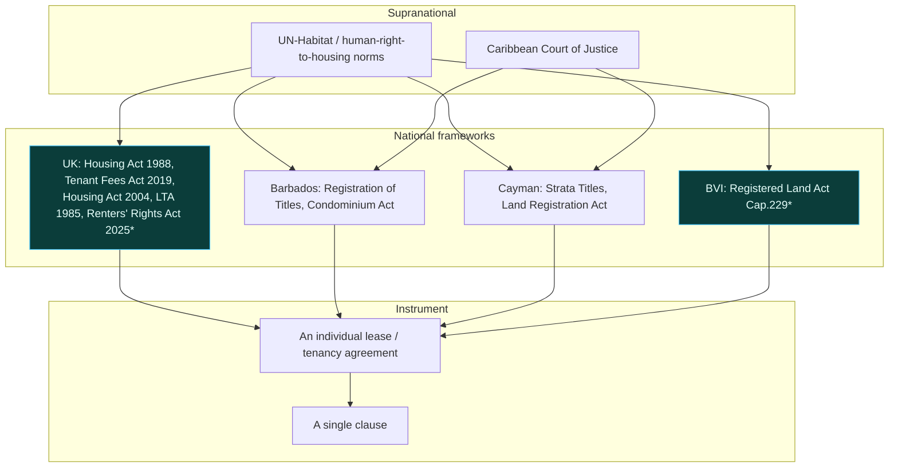
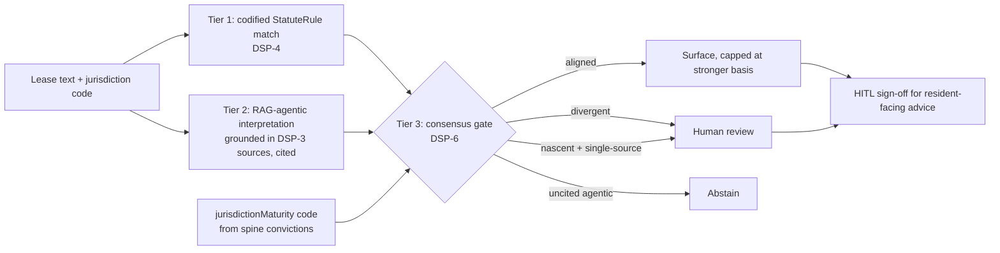

# Multi-Jurisdiction Legal Spine

**Status:** living reference · **Version:** 1.0
**Companions:** `data-structuring-protocol.md` (DSP), `automation-doctrine.md`,
`top-down-vs-bottom-up.md`.

How FreeLeased holds many legal frameworks in one structured spine and automates
across them without pretending they are the same. Launch market: **United
Kingdom**. Roadmap follows the shared common-law lineage into the Caribbean —
starting with the **UK Overseas Territories** (British Virgin Islands, Cayman)
and Barbados, whose land law descends from the same English roots.

---

## 1. Jurisdiction coverage (live in the spine)

| Code | Jurisdiction | Role | Statutes | Maturity (computed) |
|---|---|---|---|---|
| `UK` | United Kingdom | **launch** | 12 | established (0.92) |
| `BB` | Barbados | pilot | 3 | established |
| `KY` | Cayman Islands | pilot | 3 | established |
| `JM` | Jamaica | pilot | 3 | developing |
| `TT` | Trinidad & Tobago | roadmap | 2 | developing |
| `VG` | British Virgin Islands | roadmap | 2 | nascent |
| `BS` `GY` `BZ` | Bahamas, Guyana, Belize | roadmap | 0 | nascent |

Maturity is not hand-set — it is computed from the share of `verified`/
`confirmed` statutes per jurisdiction (`src/lib/jurisdiction.ts`) and served live
at `GET /api/jurisdictions/maturity`. It rises automatically as sources are
promoted.

---

## 2. The legal hierarchy (top-down)

*Starred nodes contain `inference`/`pending` citations and are confidence-capped
until verified against the primary source.*

---

## 3. How a clause is judged (the automation path, per jurisdiction)

The maturity input `M` is what makes the gate **dynamic**: the same evidence
produces a `surface` in the UK and a `review` in the BVI, because the BVI's
codified spine is not yet mature enough to stand without corroboration.

---

## 4. Adding a jurisdiction (the scalability claim, made concrete)

A new jurisdiction is **data + rules, not architecture**:

1. Add a `Jurisdiction` (DSP-1) to `JURISDICTIONS`.
2. Add `Statute` records (DSP-2) with honest `conviction` — `verified` only when
   the URL resolves to the text; otherwise `inference`/`pending`.
3. Add `DataSource` records (DSP-3) with `license` populated.
4. Add jurisdiction-scoped `StatuteRule`s (DSP-4) to the Fairness Check.
5. Nothing else changes — maturity, consensus behaviour, land profiles and the
   API routes all derive automatically. Maturity starts `nascent` and climbs as
   citations get verified.

This is why the cost-to-add-a-jurisdiction curve trends toward near-zero, and why
the gate stays safe on day one: a fresh jurisdiction cannot surface confident
claims until its spine earns it.

---

## 5. Endpoints (all live, curl-verifiable)

| Route | Purpose |
|---|---|
| `GET /api/spine/jurisdictions` | all jurisdictions (DSP-1) |
| `GET /api/spine/sources` | provenance feeds with license (DSP-3) |
| `GET /api/spine/summary` | coverage aggregate |
| `GET /api/land/:code` | cited land-intelligence profile (UK, BB, …, VG) |
| `GET /api/jurisdictions/maturity` | **dynamic** per-jurisdiction rule maturity |
| `POST /api/fairness/check` | codified clause analysis, jurisdiction-scoped |
| `POST /api/consensus/check` | consensus gate, maturity applied from `jurisdiction` |

---

## 6. Honesty carried across borders
Every jurisdiction obeys the same honesty spine (DSP-0a/0b): UK rules I can cite
to a resolvable statute are `established`; the Renters' Rights Act 2025 and all
BVI citations are `inference`/`pending` and confidence-capped until verified. We
would rather show a `review` than a wrong confident answer in a jurisdiction we
have not fully sourced. That discipline is the product.
