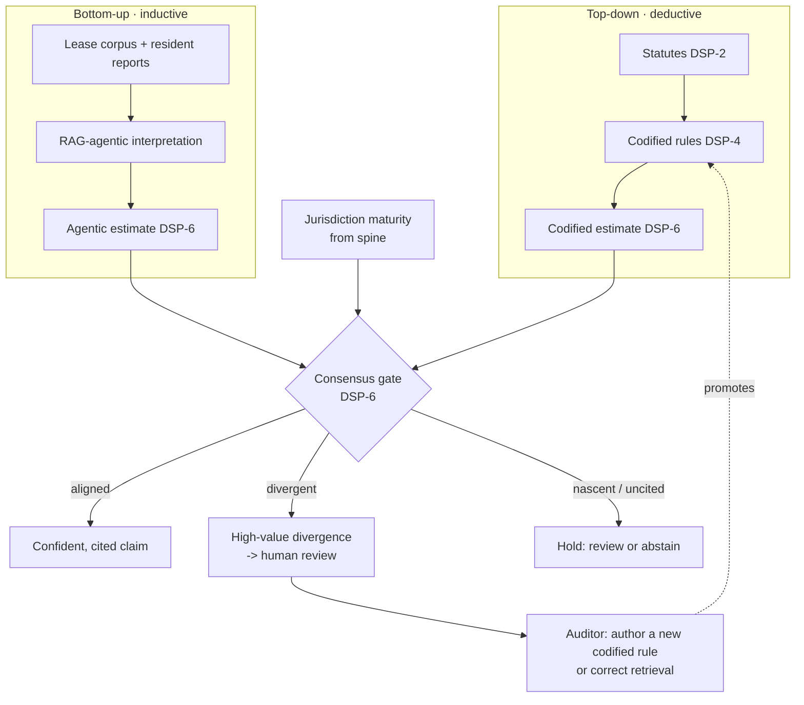
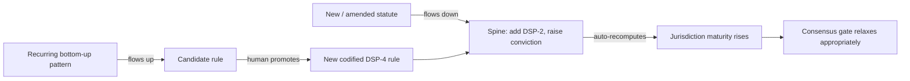

# Reconciling Top-Down and Bottom-Up

**Status:** doctrine · **Version:** 1.0
**Companions:** `automation-doctrine.md`, `multi-jurisdiction-legal-spine.md`.

FreeLeased runs two epistemologies at once and makes them check each other. This
document states how they reconcile — because a system that only did one would be
either brittle or unaccountable.

---

## The two directions

### Top-down (deductive — from the law)
Start from the legal hierarchy: statutes → protected rights → the clauses a
compliant lease should and shouldn't contain. This is the **codified** layer
(Tier 1): `StatuteRule`s that encode *what the law requires*.
- **Strengths:** authoritative, reproducible, high precision where a statute is
  clear and verified. Cites chapter and section.
- **Weaknesses:** brittle to novel wording; blind to what is actually happening
  on the ground; silent where the law is ambiguous or un-codified.

### Bottom-up (inductive — from the instruments)
Start from observed reality: actual lease clauses, resident reports, recurring
patterns across the corpus. This is the **RAG-agentic + pattern** layer (Tier 2):
retrieval and interpretation that surface *what is actually being done to people*.
- **Strengths:** catches real-world novelty, reveals gaps the statutes miss,
  resident-centric, adapts to how exploitation actually phrases itself.
- **Weaknesses:** no authority on its own; risk of hallucination/overfitting;
  cannot declare something unlawful by itself.

Neither is sufficient. Top-down alone misses the street; bottom-up alone invents.

---

## Where they meet: the consensus gate

- **Top-down is the spine of truth.** A bottom-up finding becomes a *confident*
  claim only when it aligns with a top-down rule.
- **Divergence is the most valuable output.** When codified and agentic disagree,
  it means either the law has a gap the corpus just exposed (author a new rule —
  top-down grows) or the retrieval was wrong (correct it — bottom-up improves).
  Either way a human adjudicates and the system gets better. This is the
  self-improving loop, and it is *authored*, never silent.
- **Maturity mediates the balance.** In a mature jurisdiction (UK) the top-down
  spine is trusted and can surface alone. In a nascent one (BVI) the codified
  spine hasn't earned that trust, so a claim must be corroborated bottom-up and
  is capped harder. As citations get verified, the balance tips back toward
  top-down automatically.

---

## The governance cycle (how they reconcile over time)

- **Down:** legislation changes flow *down* into the spine, raising conviction
  and maturity — the system trusts codified more as the law is confirmed.
- **Up:** field patterns flow *up* into candidate rules that a human promotes —
  the codified layer grows to cover what the corpus revealed.

Top-down keeps us **accountable** (every claim cites the law). Bottom-up keeps us
**relevant** (we see what is actually happening). The consensus gate + human
sign-off is the reconciliation mechanism, and the maturity signal is the dial
that says, per jurisdiction, how much to trust each direction today.

---

## One-line statement
*We derive from the law and we learn from the street, and we only speak
confidently where the two agree — everywhere else we say so.*
