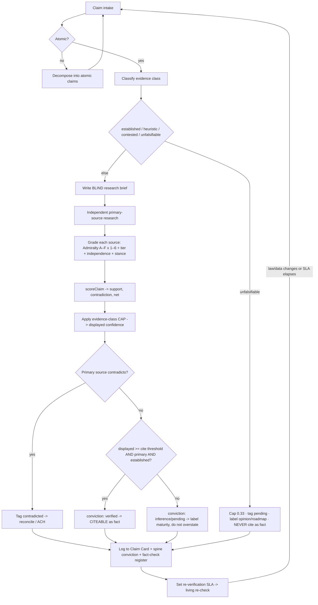
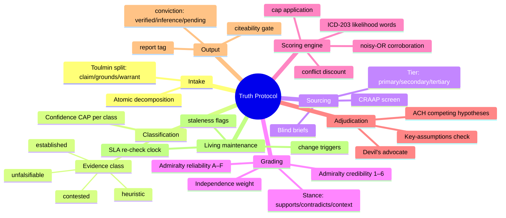
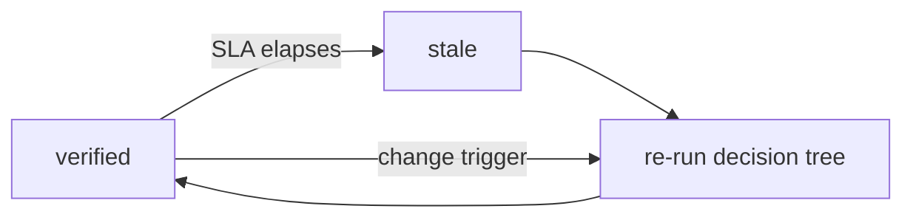

> [!abstract] What this is
> The **single, reusable process** by which any claim — a statute, a case, a
> dataset, a rival's boast, our own metric — is turned into a **calibrated,
> capped, defensible verdict**. It is deliberately *impartial by construction*:
> the process fixes the answer, the analyst does not. This is a **living
> document** — a Map of Content (MOC). The deterministic core is codified in
> [[../../src/lib/veracity|src/lib/veracity.ts]] and gated by
> [[../../src/lib/research|src/lib/research.ts]]; this note is the human-readable
> doctrine, decision tree, and templates that wrap it.

> [!info] Obsidian usage
> Drop this vault folder into Obsidian. `[[wikilinks]]` connect the protocol to
> the spine, reports, and code. The Mermaid blocks render as the decision tree
> and mindmap. Use the **Claim Card** template (below) per claim; the graph view
> then shows every claim, its sources, and its verdict as a living knowledge graph.

---

## 0. First principles (non-negotiable)

1. **Falsifiability caps confidence.** A claim that cannot in principle be
   checked can never be presented as fact — no matter how many people assert it.
   (Popper.) Encoded as `EVIDENCE_CAP` in [[../../src/lib/veracity|veracity.ts]].
2. **Primary sources outrank everything.** The statute book beats the law-firm
   blog beats the news write-up. Tier is tracked per source.
3. **Independence, not repetition, is corroboration.** Ten outlets copying one
   press release is *one* source. Independence is scored, not assumed.
4. **State uncertainty; never launder it.** Every verdict carries a calibrated
   likelihood word (ICD-203 style) and a numeric confidence. No naked adjectives.
5. **Separate claim from grounds from warrant.** (Toulmin.) We record *what* is
   claimed, *the evidence*, and *the inferential step* — so a reader can attack
   any layer.
6. **Blind the researcher.** Briefs are written without the expected answer, so
   findings aren't steered. See [[independent-research-briefs]].
7. **Everything is re-checked on a clock.** Law changes. Verified ≠ verified
   forever. SLAs in [[../../src/lib/research|research.ts]].

---

## 1. The master decision tree



---

## 2. The mindmap (the whole system at a glance)



---

## 3. The grading systems (best-practice, all real)

### 3a. Source grading — Admiralty / NATO code (STANAG 2511)
Two independent axes. Never collapse them into one number by eye — the engine does it.

| Reliability (source) | | Credibility (information) | |
|---|---|---|---|
| **A** Completely reliable | 1.0 | **1** Confirmed by other sources | 1.0 |
| **B** Usually reliable | 0.8 | **2** Probably true | 0.8 |
| **C** Fairly reliable | 0.6 | **3** Possibly true | 0.6 |
| **D** Not usually reliable | 0.4 | **4** Doubtful | 0.4 |
| **E** Unreliable | 0.2 | **5** Improbable | 0.2 |
| **F** Cannot be judged | 0.5* | **6** Cannot be judged | 0.5* |

\* Unknown maps to a **neutral 0.5**, never 0 — absence of judgement is not evidence of falsity.

### 3b. Source screen — CRAAP (fast triage before grading)
**C**urrency · **R**elevance · **A**uthority · **A**ccuracy · **P**urpose. If a
source fails Authority or Purpose (e.g. marketing copy), it cannot be graded
above `C`/`3` and can never be a *primary* tier.

### 3c. Evidence class — the confidence CAP (the core discipline)
| Class | Meaning | Cap | Example |
|---|---|---|---|
| `established` | Falsifiable **and** checkable against a primary source | **0.99** | "LFRA s.49 changes 25%→50%" (verbatim in the Act) |
| `heuristic` | Reasoned pattern / expert judgement, not directly falsifiable | **0.75** | "RTM is being used as an interim control strategy" |
| `contested` | A credible live dispute exists | **0.60** | Enfranchisement valuation rates (under JR + consultation) |
| `unfalsifiable` | Cannot in principle be checked | **0.33** | "court-readiness 100/100"; "£1.98tn value-at-risk" |

### 3d. Likelihood language — ICD-203 calibration
`almost certain ≥0.9 · highly likely ≥0.75 · likely ≥0.55 · roughly even ≥0.45 ·
unlikely ≥0.3 · highly unlikely ≥0.1 · remote <0.1`. Implemented as
`likelihoodLanguage()`.

---

## 4. The algorithm (data-science core)

Codified in [[../../src/lib/veracity|src/lib/veracity.ts]], 22 tests in
`scripts/test-veracity.ts` + wired into `scripts/test-suite.ts`.

**Per source** — mass = `reliability × credibility × independence` (all 0–1).

**Corroboration** (independent supporting sources) — noisy-OR:
$$ \text{support} = 1 - \prod_i (1 - m_i) $$
Diminishing returns; robust to one weak source; rewards *independent* agreement.

**Conflict discount** — contradicting mass erodes support (Dempster-Shafer-lite):
$$ \text{net} = \text{support} \times (1 - \text{contradiction}) $$

**Cap** — the non-negotiable ceiling:
$$ \text{displayed} = \min(\text{net},\; \text{cap}(\text{evidenceClass})) $$

**Verdict mapping** →
- `conviction`: `verified` (displayed ≥0.75, has primary, low contradiction, established) · `inference` · `pending`
- `reportTag`: `confirmed (primary)` · `confirmed (secondary only)` · `partly confirmed` · `contradicted` · `not found`
- `citeable`: true only if `verified` **and** displayed ≥ threshold (0.8) **and** primary source present **and** class = `established`.

> [!example] Worked example — LFRA s.49
> Sources: legislation.gov.uk (primary, A/1, supports) + a law-firm summary
> (secondary, C/2, supports). Class `established`.
> → support ≈ 0.99, contradiction 0, net ≈ 0.99, cap 0.99 →
> **displayed ≈ 0.99, conviction `verified`, tag `confirmed (primary)`, citeable ✔**.
> Contrast "court-readiness 100/100" (class `unfalsifiable`): even with a perfect
> primary source, **displayed ≤ 0.33, conviction `pending`, citeable ✘**.

---

## 5. Adjudication when sources conflict — ACH

When a primary source **contradicts** (tag `contradicted`), don't pick a side —
run **Analysis of Competing Hypotheses** (Heuer). List hypotheses across the top,
evidence down the side, mark each cell consistent (+) / inconsistent (−) /
neutral (·). **The hypothesis with the fewest inconsistencies wins** — you
*disprove*, not *confirm*.

| Evidence \ Hypothesis | H1: claim true | H2: claim false | H3: ambiguous |
|---|---|---|---|
| Primary source text | | | |
| Secondary consensus | | | |
| Recency / commencement | | | |

Pair with a **Key-Assumptions Check** (what must be true for this to hold?) and
a **Devil's-Advocate** pass (argue the opposite from the same evidence).

> [!example] ACH in action — Jamaica strata statute
> H1 "Condominium Act 1958 governs" vs H2 "Registration (Strata Titles) Act
> governs". Primary sources are **inconsistent with H1**, consistent with H2 →
> H1 disproved. Logged in [[fact-check-register]]; spine already correct.

---

## 6. Templates

> [!note]- Claim Card (one note per atomic claim — copy into vault)
> ```
> ---
> type: claim-card
> tags: [claim]
> evidenceClass: established | heuristic | contested | unfalsifiable
> conviction: verified | inference | pending
> displayed: 0.00
> citeable: false
> reviewOn: YYYY-MM-DD
> ---
> # Claim
> <atomic statement>
> ## Grounds (evidence)
> - [ ] source — tier — Admiralty A/1 — stance — independence — [[link]]
> ## Warrant (inferential step)
> <why the grounds support the claim>
> ## Verdict (from scoreClaim)
> displayed · reportTag · conviction · language · reasons
> ## Rebuttals / open questions
> ## Related:: [[spine]] [[fact-check-register]]
> ```

> [!note]- Blind research brief (see [[independent-research-briefs]] for the full pack)
> Objective · neutral questions (no expected answer) · primary-source requirement ·
> tagging scheme · "report if not found".

---

## 7. Living maintenance (the clock)

Verification decays. `research.ts` sets SLAs: **statutes 180d, contracts 120d,
jurisdictions 365d**; `computeStaleness()` flags overdue records and
`maintenanceReport()` ranks them. **Change triggers** (a new commencement SI, a
judgment, a dataset revision) force an immediate re-run of §1 regardless of the
clock.



---

## 8. How the pieces connect (MOC)

- **Doctrine (this note)** → wraps the code.
- **Engine** → [[../../src/lib/veracity|veracity.ts]] (`scoreClaim`) + [[../../src/lib/research|research.ts]] (draft→gate→verified + SLA).
- **Blind inputs** → [[independent-research-briefs]].
- **Applied outputs** → [[research-report-01-lfra-rtm]], [[fact-check-register]].
- **Data of record** → [[../../src/data/spine|spine.ts]] (`conviction` per statute).
- **Alignment gate** → [[../../src/lib/consensus|consensus.ts]] · **fairness** → [[../../src/lib/fairness|fairness.ts]].

> [!success] Definition of done for any claim
> It has a Claim Card, a verdict from `scoreClaim`, a primary-source citation (or
> an explicit `not found`), a maturity label that matches its `conviction`, and a
> `reviewOn` date. Only then may it enter the deck, the overview, or the product.
