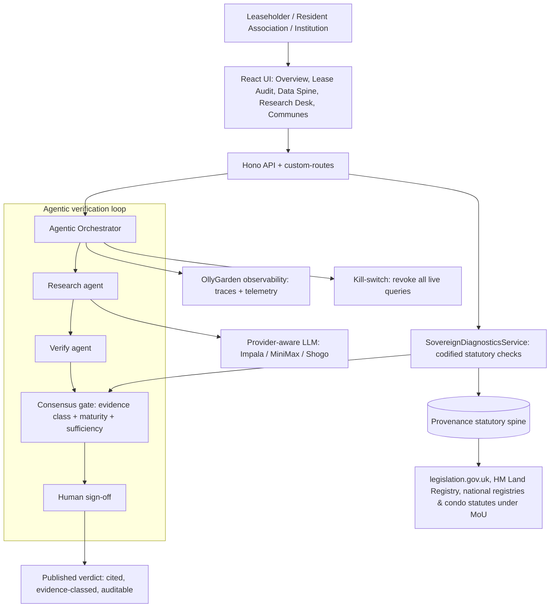
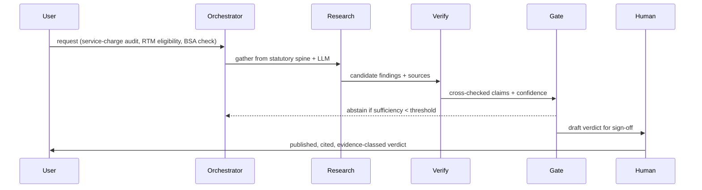

# FreeLeased / RTM Sovereign — Architecture and Agentic Workflow (v4)

**Track:** AI for Real Estate & Development · leasehold governance, service-charge audit & RTM.

## System overview
RTM Sovereign is a Vite and React front end backed by a Hono and Prisma (SQLite) service, orchestrating a multi-agent loop over a provenance-tracked statutory spine. It is **local-first**: a leaseholder's documents are redacted of PII on-device, and the codified diagnostics run deterministically with no model in the path. Inference (used only where a judgement resists codification) is provider-flexible: the sponsor Impala gateway or MiniMax when their keys are present, and the Shogo pod gateway otherwise. The whole system builds and runs inside Shogo, on sponsor inference (Impala, MiniMax) and sponsor compute (Nebius, Highrise).

## Component diagram

## Agentic workflow (sequence)

## Evidence-class model
Every output is tagged one of four classes, which caps displayed confidence:
- **established** — corroborated by an authoritative source with provenance.
- **heuristic** — reasonable inference from partial data.
- **contested** — sources disagree; both shown.
- **unfalsifiable** — cannot be tested; carried at lowest weight and flagged.

The system abstains rather than fabricates when data sufficiency falls below a published threshold. This is enforced in code, not left to prompt wording.

## Data, models, and tools used
- **Inference:** Impala gateway (`qwen3.6-27b`, OpenAI-compatible), MiniMax (partner), Shogo pod gateway (fallback). Selected by env at request time.
- **Compute:** Nebius GPU credits and Highrise H200 for batch statute embedding and clause-retrieval indexing.
- **Data sources:** legislation.gov.uk (UK primary statute, OGL v3), HM Land Registry, national statistics offices, and national land registries / condominium statutes under MoU. Every source carries a licence and a fetch timestamp.
- **Platform:** Shogo (agent orchestration, build, hosting), Prisma and SQLite (persistence), Hono (API).
- **Observability:** OllyGarden (agent-loop traces and telemetry).

## Responsible-AI controls (mapped to Code of Conduct sections 4 and 5)
- AI-generated outputs are labelled and evidence-classed.
- Human sign-off gates every published verdict; users can opt out, request human review, and appeal.
- Orchestrator kill-switch revokes all live queries in one call.
- The Fairness Check analyses document text only; it scores clauses against statute, never profiles people. No social scoring, emotion inference, biometric categorisation, or behavioural prediction is performed.

## Honest cut — what is live vs roadmap
We demo only what runs, and label the rest as roadmap. Nothing below is implied to be built.

| Component | Status |
|---|---|
| SovereignDiagnosticsService (codified statutory checks) | **live, verified** |
| Provenance statutory spine (UK + Caribbean) | **live** |
| Resident audit + local PII redaction | **live** |
| Consensus gate + human sign-off (HITL) | **live** |
| Collective aggregation (communes) | **live (v1)** |
| OpenClaw autonomous agents · `hermes_bridge.py` · Companies House scraping | **roadmap** |
| Paillier homomorphic voting · WebAuthn passkeys · CitadelDB (AES-GCM) storage | **roadmap** |
| Full 150-vulnerability audit set | **partial** — a real subset ships; count stated honestly |

## Deployment tiers
- Cloud SaaS (institutions/API; residents free).
- **Self-hosted / sovereign-edge tier:** every byte stays on-territory for data sovereignty — deployable to OWC edge/sovereign hardware so land and building data never leaves the jurisdiction.
